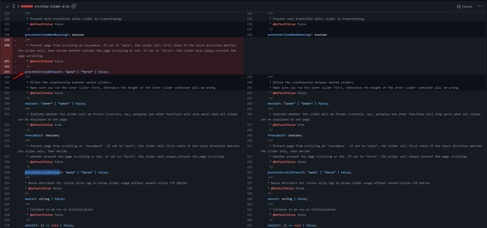

# EBuy - O E-commerce mais próximo de você :shopping_cart:

## Descrição

Este é um projeto, ainda em fase de desenvolvimento, de um E-Commerce simples que utilizará tecnologias como:

- Angular 15.2.0;
- .NET 7;
- Entity Framework;
- SQL Server 2019.

## Estrutura de pastas do repositório

No momento o projeto só possui os arquivos do front-end em Angular e um modelo físico de como será o banco de dados (sujeito a modificações). Em breve, será inserido os arquivos do back-end no projeto também (que atualmente está sendo simulado por uma Fake API com json-server):

- Projeto Angular: `./ebuy.app`
- Projeto Fake API (temporariamente): `./ebuy.server`
- Modelo físico do banco: `./database`

## Como executar o projeto?

Primeiro, certifique-se de que você tenha o [Angular 15.2.0](https://angular.io/cli) ou posterior instalado em sua máquina e também a dependência global do [json-server](https://www.npmjs.com/package/json-server). Após isso, faça o clone do repositório para sua máquina, entre na pasta da Fake API e execute `json-server --watch .\ebuy.json`. Restando apenas o front-end para ser executado, entre na pasta do Projeto em Angular e instale as dependências com `npm i`. Assim que finalizado, execute no seu terminal `ng s`.

### Observações
O projeto em Angular possui uma lib chamada tiny-slider para criar o componente de "carrousel vertical" para as imagens dos produtos. No atual momento (07/03/2023), a biblioteca possui um erro que ao executar o projeto aparece que um dos atributos da interface `TinySliderSettings` chamado `preventScrollOnTouch` está duplicado. Existe um [pull request](https://github.com/ganlanyuan/tiny-slider/pull/598) que ainda está pendente para repositório oficial, mas ainda não foi realizado o merge. Então enquanto a correção não é feita, podemos seguir da seguinte forma:

- Acesse o diretório: `node_modules > tiny-slider > src`;
- Abra o arquivo `tiny-slider.d.ts`;
- Remova a linha duplicada como na imagem abaixo:

